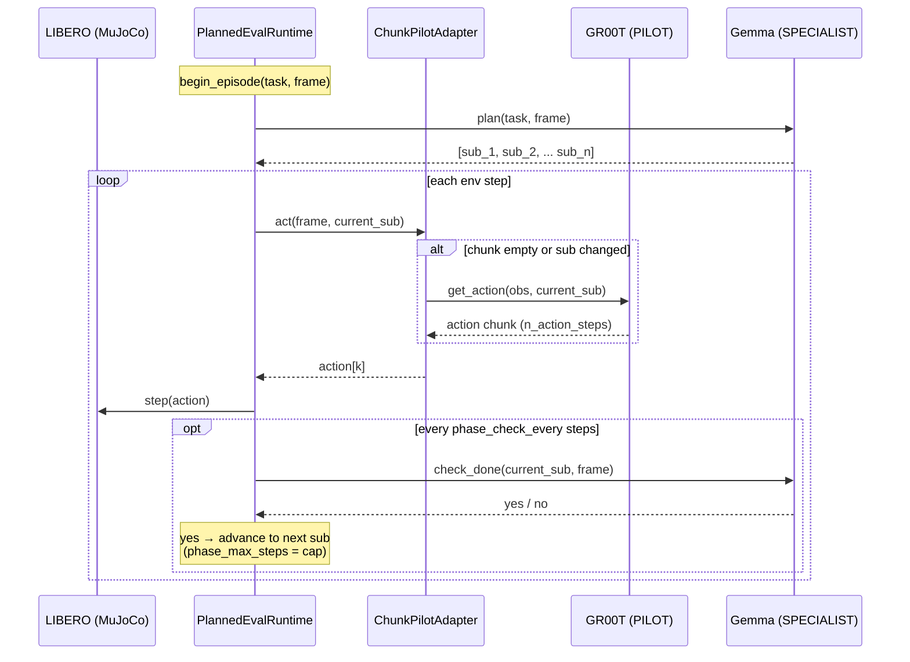
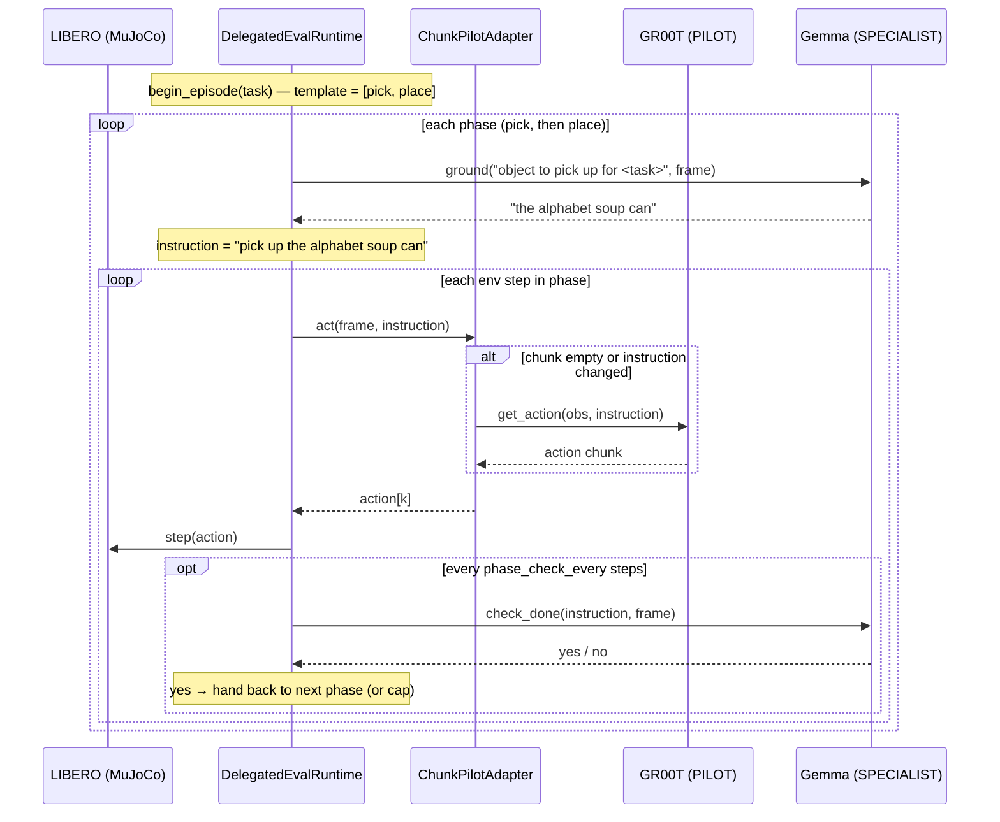
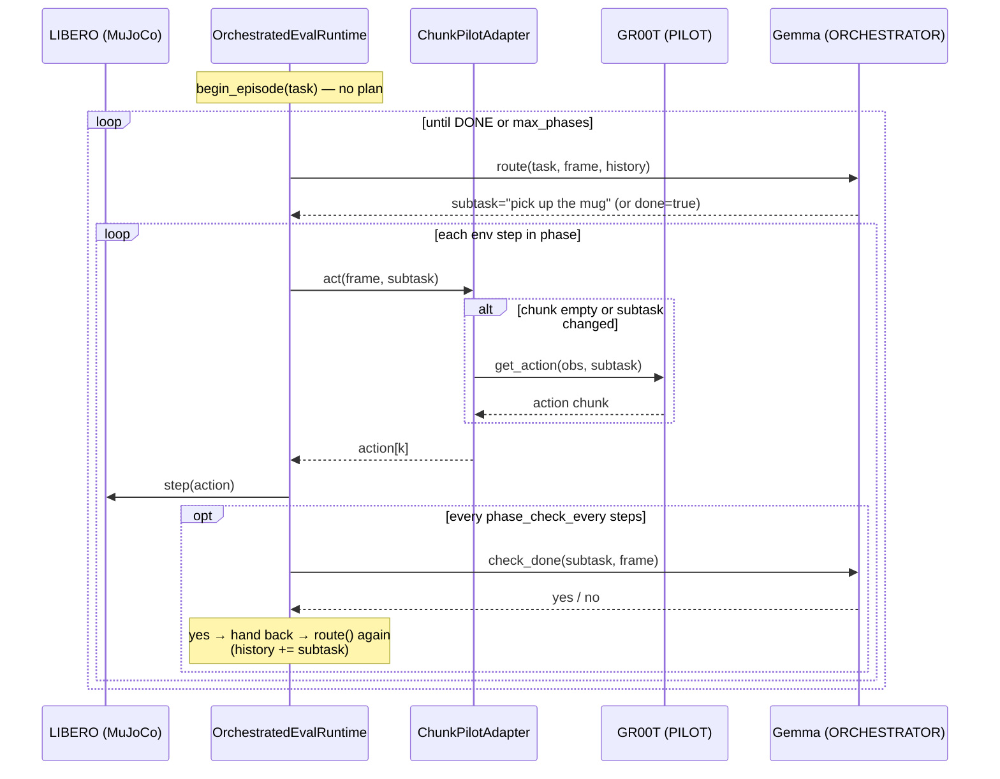

# Multi-agent eval — execution flow

How a multi-agent LIBERO evaluation actually runs, per coordination arm. This is
the map to read before changing the runtimes. Everything below is the
`pilot: gr00t` path (LIBERO on **robosuite/MuJoCo**, not Isaac Sim).

## Processes & transports

Four processes talk over two transports:

```
odyssey run mission.yaml
  └─ engine ── LiberoRunner (pilot: gr00t) ── _run_gr00t_pilot
        └─ gr00t_libero_eval.py            [subprocess · env_pilot_libero]
             owns: the LIBERO env + the coordination runtime + the two clients
             ├─ GR00T policy server         [subprocess · Isaac-GR00T venv]  ← PILOT
             │     transport: ZMQ (PolicyClient)          emits action CHUNKS
             └─ RemotePlanner                [subprocess · Gemma venv]        ← SPECIALIST / ORCHESTRATOR
                   transport: JSON-lines stdin/stdout      answers plan / ground / check / route
```

- **PILOT** = GR00T-N1.7 (chunk-emitting VLA). Queried once per *chunk* (~every
  `n_action_steps`), not per step — that's the latency win.
- **SPECIALIST / ORCHESTRATOR** = one reused Gemma. Same loaded model answers all of
  `plan` / `ground` / `check_done` / `route` — zero extra VRAM.
- The recipe (`gr00t_libero_eval.py`) is the deterministic Python driver: it owns the
  env loop and wires PILOT + SPECIALIST into one of three runtimes.

## The shared per-step machinery

Every arm drives the same inner loop (`gr00t_libero_eval.py :: run_eval`):

```
runtime.begin_episode(task, frame)          # plan / route / — depending on arm
for each env step:
    adapter.set_obs(obs)                     # push the full LIBERO obs to the pilot adapter
    action = runtime.get_action(frame)       # runtime feeds the current sub-instruction
    obs = env.step(action)                   # robosuite/MuJoCo
    for ev in runtime.drain_phase_events():  # {capability, reason, from, to, instruction}
        log(ev)
    if done: success                         # LIBERO sets done when solved
```

The **`ChunkPilotAdapter`** sits between the runtime and GR00T: it buffers a chunk,
drains one action per `get_action`, and **re-queries GR00T only when the chunk is
exhausted OR the sub-instruction changed** (a phase advance). That instruction-change
flush is the "chunk-aware gating" — the runtime stays chunk-oblivious.

Phase transitions are surfaced as events via `drain_phase_events()`:

| field | values |
|---|---|
| `capability` | `plan` \| `grounding` \| `routing` \| `handback` |
| `reason` | `fixed_steps` \| `timeout` \| `completion` \| `cap` \| `route` \| `grounding` |
| `from` / `to` | phase indices |
| `instruction` | the sub-instruction in play |

The only thing that differs between arms is **who owns the sequence**.

---

## Arm 1 — `coordination: planning`

The SPECIALIST authors the whole sub-instruction list **once** at episode start; the
runtime marches it, gating advances with `check_done` (when
`phase_strategy: completion_gated`).



Who decides the sequence: **SPECIALIST, up front.**

---

## Arm 2 — `coordination: delegation`

No plan up front. A deterministic **`pick → place` template** owns the sequence; per
phase the SPECIALIST **grounds** the target ("where is the object to pick up?"), which
is spliced into the pilot instruction. Hand-back is completion-gated.



Who decides the sequence: **the fixed template**; the SPECIALIST only grounds targets.

---

## Arm 3 — `coordination: orchestration` (regime D)

No plan and no template. An **LLM ORCHESTRATOR routes the next sub-instruction
dynamically** at each phase boundary, looking at the live scene + what's already been
done, or declares `DONE`. Hand-back is completion-gated; `max_phases` caps runaway
routing.



Who decides the sequence: **the ORCHESTRATOR LLM, dynamically.**

---

## At a glance

| | planning | delegation | orchestration |
|---|---|---|---|
| Runtime | `PlannedEvalRuntime` | `DelegatedEvalRuntime` | `OrchestratedEvalRuntime` |
| Sequence owner | SPECIALIST (`plan`, once) | fixed `pick→place` template | ORCHESTRATOR (`route`, per phase) |
| SPECIALIST/ORCHESTRATOR verb | `plan` + `check` | `ground` + `check` | `route` + `check` |
| Phase advance | completion-gated / fixed-steps | completion hand-back | completion hand-back |
| PILOT | GR00T chunks (adapter) | GR00T chunks (adapter) | GR00T chunks (adapter) |

To see this live, run with `config.trace: true` — the recipe logs each PILOT /
SPECIALIST / ORCHESTRATOR action as it happens.
